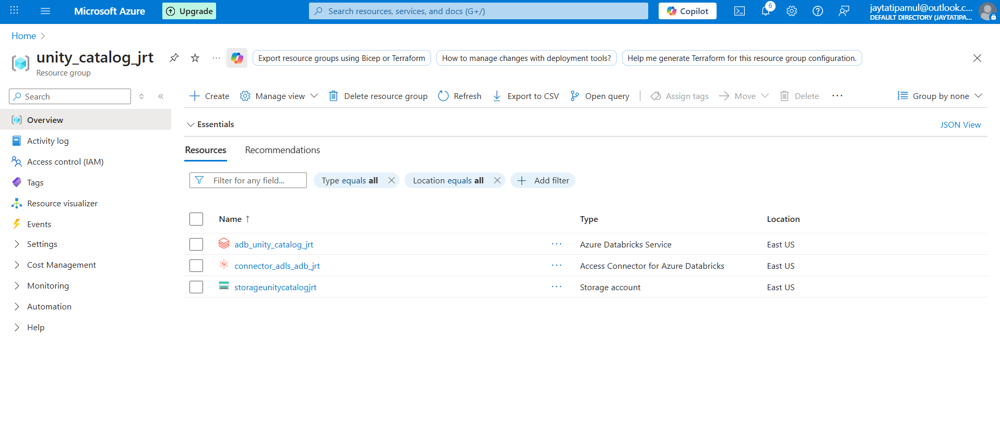
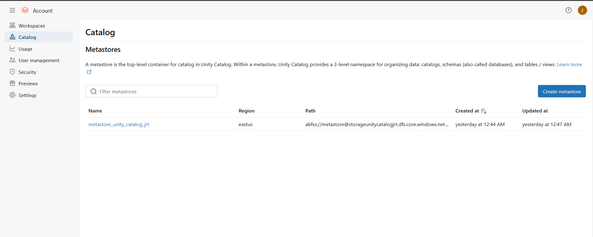
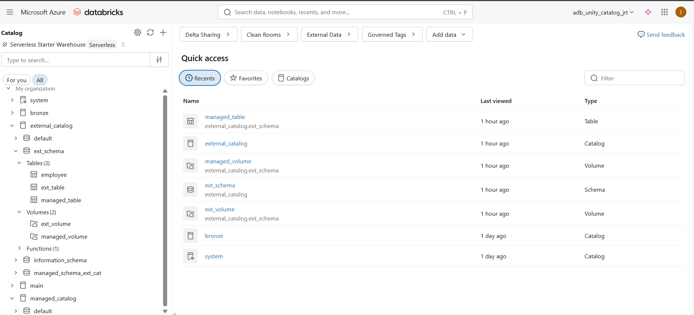
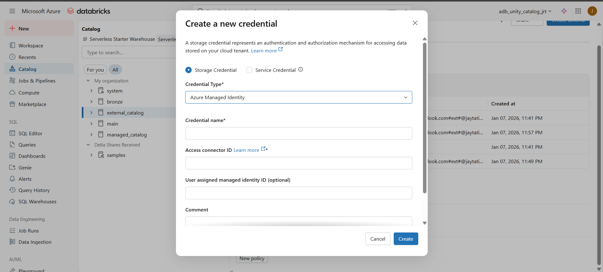

# Azure Databricks Unity Catalog Project
This repository demonstrates a complete Unity Catalog setup and implementation in Databricks, focusing on centralized data governance, metadata management, and access control

## 🎯 Project Objective
To implement **Databricks Unity Catalog as a centralized governance layer** that enables:
- Secure and consistent access to data assets  
- Centralized metadata management  
- Fine-grained access control across catalogs, schemas, and tables  
- Governance enforcement across Databricks workspaces 

## What is Unity Catalog?
Unity Catalog is a fine-grained data governance solution for data present in a Data Lake.

## Why Unity Catalog is Used Primarily?
Suppose, in a lakehouse project, there is a database in the Hive Metastore of a Databricks Workspace, and, in that database, there are Twenty Delta Tables present.
If the requirement is to provide a specific set of permissions, like Read Only, or, Write Only to a specific Group of Users on one, or, some of the particular Delta Tables, or, even at the Row Level, or, Column Level, which can contain a Personally Identifiable Information, i.e., PII, of that particular Delta Tables, then the Unity Catalog can simplify the solution to the requirement by implementing the Unified Data Access Control.
So, the primary reason for using the Unity Catalog is that it helps to simplify the security, as well as, the governance of the data by providing a centralised place, where it is possible to administer the access to the data, and, also audit the access to the data.

## In What Type of Databricks Workspace, the Unity Catalog can be Used?
The Unity Catalog is only available in the Premium pricing tier.
The Unity Catalog is available across multiple Clouds, i.e., on Azure, Amazon, and, Google Cloud Platform.

## Why Unity Catalog is Considered as Unified Catalog?
The Unity Catalog is considered as a Unified Catalog in the sense that it can store all the Databricks Workspace Objects, like - data, Machine Learning Models, Analytics Artifacts etc., in addition to the Metadata for each of the Databricks Workspace Objects. Whatever is stored inside the Unity Catalog, becomes an Object. Once an artifact that is stored inside the Unity Catalog becomes an Object, it is possible to provide the selective access to that particular Object. The Unity Catalog is also considered as a Unified Catalog because, it is possible to blend in the data from other Catalogs, such as existing Hive Metastores into the Unity Catalog.

## What is the Data Lineage Feature in Unity Catalog?
Suppose, in a lakehouse project, a particular Column of a target Delta Table is derived from multiple Columns of three other Delta Tables by using some transformation logic.
In such cases, using the Unity Catalog, it is possible to visualize the Data Lineage of that target Delta Table to get the end-to-end visibility into how the data flows in the lakehouse project from the source layer to the consumption layer.

## What is the Data Sharing Feature in Unity Catalog?
Suppose, in a lakehouse project, there are twenty Delta Tables in a database.
If the requirement is to share the data of those twenty Delta Tables across the different platforms, or, the different Clouds, it can be done so, by using the Data Sharing feature of the Unity Catalog.
Data Sharing is an protocol, that is developed by Databricks for secure data sharing with other organizations, or, with other teams within the organization, regardless of which computing platform the other teams use.

## Overview of Unity Catalog
Unity Catalog is a centralized data catalog that provides access control, auditing, lineage, quality monitoring, and data discovery capabilities across Azure Databricks workspaces.

Key features of Unity Catalog include:

**Define once, secure everywhere:** Unity Catalog offers a single place to administer data access policies that apply across all workspaces in a region.

**Standards-compliant security model:**  Unity Catalog's security model is based on standard ANSI SQL and allows administrators to grant permissions in their existing data lake using familiar syntax.

**Built-in auditing and lineage:** Unity Catalog automatically captures user-level audit logs that record access to your data. Unity Catalog also captures lineage data that tracks how data assets are created and used across all languages.

**Data discovery:** Unity Catalog lets you tag and document data assets, and provides a search interface to help data consumers find data.

**System tables:** Unity Catalog lets you easily access and query your account's operational data, including audit logs, billable usage, and lineage.

## 🏗️ Architecture Overview

Unity Catalog follows a hierarchical structure: In a Unity Catalog metastore, the three-level database object hierarchy consists of catalogs that contain schemas, which in turn contain data and AI objects, like tables and models. This hierarchy is represented as a three-level namespace (catalog.schema.table-etc) when you reference tables, views, volumes, models, and functions

```
Metastore
└── Catalog
└── Schema
└── Tables / Views / Volumes / Functions

```


## ⚙️ Step-by-Step Unity Catalog Implementation

This section documents the **end-to-end implementation steps** followed to set up **Databricks Unity Catalog** with Azure resources, storage integration, and governance controls.

---

### 1️⃣ Azure Resource Group Creation
- Created a dedicated **Azure Resource Group** to host all Unity Catalog–related resources.
- Used the same resource group for Databricks, Storage Account, and Access Connector to maintain consistency.

---

### 2️⃣ Azure Data Lake Storage Gen2 Setup
- Created an **Azure Data Lake Storage Gen2 (ADLS Gen2)** account.
- Enabled **Hierarchical Namespace**.
- This storage account is used for:
  - Metastore managed storage
  - External data locations
  - Catalog- and schema-level storage

---

### 3️⃣ Azure Databricks Workspace
- Created an **Azure Databricks Workspace**.
- Selected **Premium pricing tier** (mandatory for Unity Catalog support).

---

### 4️⃣ Access Connector for Azure Databricks
- Before creating the metastore, created an **Access Connector for Azure Databricks**.
- Used the **same resource group** as Databricks and Storage Account.
- This access connector acts as the **managed identity** for Unity Catalog to access storage.




---

### 5️⃣ Grant Storage Access to Access Connector
- Navigated to the **Storage Account → Access Control (IAM)**.
- Assigned the following role to the Databricks Access Connector:
  - **Storage Blob Data Contributor**
- This enables Unity Catalog to **read and write data** in ADLS Gen2.

---

### 6️⃣ Unity Catalog Metastore Creation
- Logged in to the **Databricks Account Console**.
- Created a **Unity Catalog Metastore** with:
  - Storage path pointing to ADLS Gen2 container
  - Access Connector Object ID
- Assigned **all required Databricks workspaces** to the metastore.



---

### 7️⃣ Metastore Validation
- Logged in to the **Azure Databricks Workspace UI**.
- Navigated to **Catalog → Settings**.
- Verified that the **Unity Catalog Metastore is attached** to the workspace

---

### 8️⃣ Catalog Creation
- Created a catalog under the attached metastore.

```sql
CREATE CATALOG IF NOT EXISTS enterprise_catalog;

```


---
### 9️⃣ Additional Storage Containers

Created two additional containers in ADLS Gen2:

raw

enriched

These containers are used for external data storage and organization.


---
### 🔟 Storage Credentials & External Locations

Created Storage Credentials in Unity Catalog using: Databricks Access Connector & ADLS Gen2 path

Established connectivity between:

ADLS containers

Unity Catalog objects (catalogs)



---
### 1️⃣1️⃣ Storage Hierarchy Validation

Validated how data is stored and managed at different levels:

Metastore-level storage

Catalog-level storage

Schema-level storage

Object-level (table / volume) storage


---

### 1️⃣2️⃣ Volumes Creation

Created Unity Catalog Volumes to manage non-tabular data.

Verified read/write access through Databricks workspace.

---

### 1️⃣3️⃣ Data Masking Function

Implemented a Unity Catalog function for data masking.

Used the function to control sensitive data visibility based on access level.

---

## ✅ Final Outcome

Successfully implemented Unity Catalog end-to-end

Integrated Azure Databricks with ADLS Gen2 using Access Connector

Enabled centralised governance and RBAC

Validated storage behaviour at all Unity Catalog levels

Implemented data masking for sensitive columns


## 📌 Notes

This implementation follows Databricks-recommended best practices for Unity Catalog setup and governance in Azure environments.

## Acknowledgment 🎉
This project draws inspiration from a detailed video of Ansh Lamba, check out his YouTube channel. Special thanks to Ansh for providing such valuable resources and guidance for aspiring data engineers!
